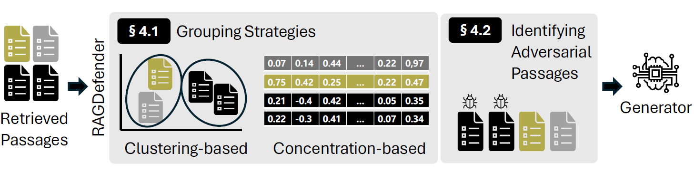
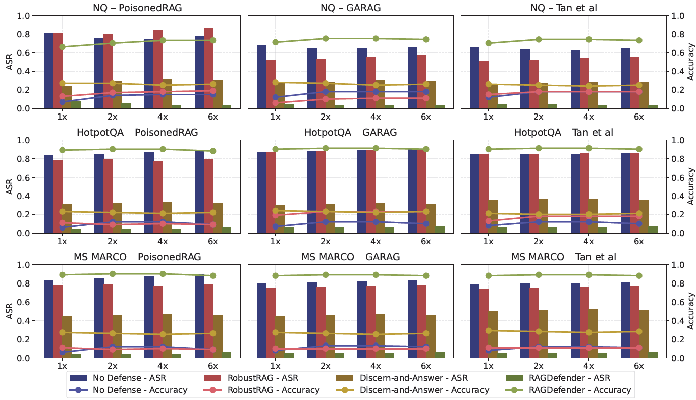

# Meet RAGDefender: Our New Lightweight Defense for Securing RAG Systems

Retrieval-Augmented Generation (RAG) is a powerful technique for making Large Language Models (LLMs) smarter, more accurate, and more current. By fetching relevant information from external knowledge bases, RAG systems can answer questions about recent events and ground their responses in verifiable facts, reducing hallucinations.

But this new capability introduces a critical new vulnerability: **What if the knowledge base itself is poisoned?**

This is the question at the heart of our new paper, "[Rescuing the Unpoisoned: Efficient Defense against Knowledge Corruption Attacks on RAG Systems](https://arxiv.org/abs/YOUR_ARXIV_LINK_HERE)," which has been accepted to the **Annual Computer Security Applications Conference (ACSAC) 2025**.

We found that an attacker can inject a small amount of misleading or "poisoned" data into a RAG system's knowledge base. When a user asks a question, the RAG system retrieves this malicious content and, trusting its source, generates a confident but completely incorrect answer.

Existing defenses against this are often too slow, too expensive, or both. Many require fine-tuning specialized models or using multiple, costly LLM inference calls to vet each piece of retrieved information.

We knew there had to be a better way.

### Our Solution: RAGDefender

I'm thrilled to introduce **RAGDefender**, the open-source defense mechanism we built to solve this problem.

RAGDefender is a lightweight and resource-efficient filter that operates *after* passages are retrieved but *before* they are sent to the LLM generator. It is designed to be:

* **Efficient:** It **does not require any additional LLM inferences** or model (re-)training, making it significantly faster and cheaper than existing methods.
* **Effective:** It is built on the key insight that adversarial passages, to be successful, must be highly similar to each other. RAGDefender uses lightweight machine learning techniques to detect these dense, malicious clusters and filter them out.
* **Adaptable:** It's a plug-and-play module that can be seamlessly integrated into a wide range of RAG architectures.

---

### How RAGDefender Works: A Two-Stage Approach

RAGDefender’s core logic is a simple but powerful two-stage process that identifies and isolates adversarial content.



**Stage 1: Grouping Retrieved Passages (§4.1)**
When the retriever fetches a set of passages, RAGDefender first groups them. It uses two novel strategies tailored to the type of question:
* **Clustering-based Grouping:** For single-hop questions, it uses hierarchical agglomerative clustering to partition passages. Adversarial passages tend to form dense, tight clusters, which this method excels at identifying.
* **Concentration-based Grouping:** For more complex multi-hop questions, where legitimate passages are naturally more diverse, this strategy identifies adversarial passages by their "concentration factors," isolating the highly concentrated misleading information.

**Stage 2: Identifying Adversarial Passages (§4.2)**
After the initial grouping, RAGDefender's second stage performs a fine-grained analysis to precisely identify the malicious passages. It calculates a frequency score for each passage based on its semantic similarity to other passages. The passages most likely to be adversarial (i.e., those that form the tight, suspicious cluster) are ranked highest and then filtered out.

The remaining "safe" passages are then passed to the LLM, which can now generate a response based on clean, unpoisoned knowledge.

---

### Just How Effective Is It? The Results

We benchmarked RAGDefender against several state-of-the-art attacks (like PoisonedRAG, GARAG, and Tan et al.) and compared it to other defense mechanisms (like RobustRAG and Discern-and-Answer).

The results were remarkable.

* **Unmatched Effectiveness:** In a challenging scenario with 4x more adversarial passages than benign ones, a RAG system using the Gemini model had an Attack Success Rate (ASR) of **0.89** (89%). After applying RAGDefender, the ASR plummeted to just **0.02** (2%). The next-best defenses, RobustRAG and Discern-and-Answer, only managed to lower the ASR to 0.69 and 0.24, respectively.

* **Blazing Fast & Lightweight:** RAGDefender is **12.36x faster** than RobustRAG because it avoids costly LLM calls. Furthermore, it **consumes no additional GPU memory** during inference, while other methods can require over 41GB for fine-tuning or 33GB for inference.



---

### Get Started with RAGDefender

We've made RAGDefender available to the entire community. You can start using it in your own projects right away or replicate our full experimental setup.

**1. Try It Live (Google Colab)**

The easiest way to see RAGDefender in action is with our Google Colab notebook. You can run the code and experiment with the defense in your browser, no setup required.

* **Colab Notebook:** [**Run RAGDefender Live!**](https://colab.research.google.com/drive/18PWLhhlgs4XSCmrg-Tp0AuIinAkipFgc#scrollTo=I2oOjNHuc6Ea)

**2. Quick Install (Use the Library)**

For developers who want to integrate RAGDefender into their RAG pipelines, we've published it as a Python package on PyPI.

You can install it directly via pip:

```bash
pip install ragdefender
```

This will install the core library and its main dependencies (like `torch`, `scikit-learn`, `transformers`, and `sentence-transformers`). You can then import it into your RAG pipeline as a post-retrieval filtering step.

**3. Full Reproduction (Run the Experiments)**

For fellow researchers who want to reproduce our ACSAC 2025 results, we have released the full artifact on GitHub. This repository contains all the code, models, and scripts necessary to run the evaluation.

**GitHub Repository:** [**https://github.com/SecAI-Lab/RAGDefender**](https://github.com/SecAI-Lab/RAGDefender)

To get started, clone the repository and use the provided installation script. This script will create a dedicated conda environment and download the required models and datasets.

```bash
git clone [https://github.com/SecAI-Lab/RAGDefender.git](https://github.com/SecAI-Lab/RAGDefender.git)
cd RAGDefender
./install.sh
```

---

### The Future of Secure RAG

We believe RAGDefender is a vital contribution to building more robust, resilient, and trustworthy AI systems. By providing an open-source, efficient, and effective defense, we hope to empower developers and researchers to secure their RAG applications against this critical new attack vector.

We welcome any feedback, contributions, and discussions on GitHub!

* **Read the full paper on arXiv:** [Link to your arXiv paper]
* **Explore the code on GitHub:** [https://github.com/SecAI-Lab/RAGDefender](https://github.com/SecAI-Lab/RAGDefender)
* **Install the package:** `pip install ragdefender`

---
**Citation Note:** All claims and data points in this post are sourced from our paper: *Minseok Kim, Hankook Lee, Hyungjoon Koo (2025). "Rescuing the Unpoisoned: Efficient Defense against Knowledge Corruption Attacks on RAG Systems." In Proceedings of the Annual Computer Security Applications Conference (ACSAC).*